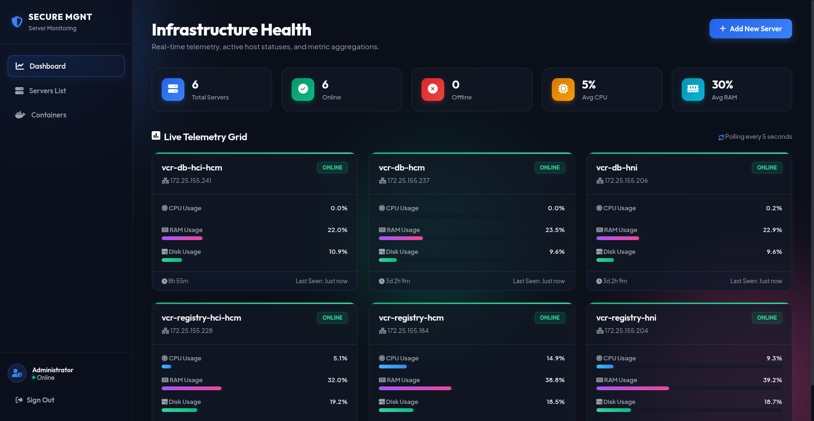
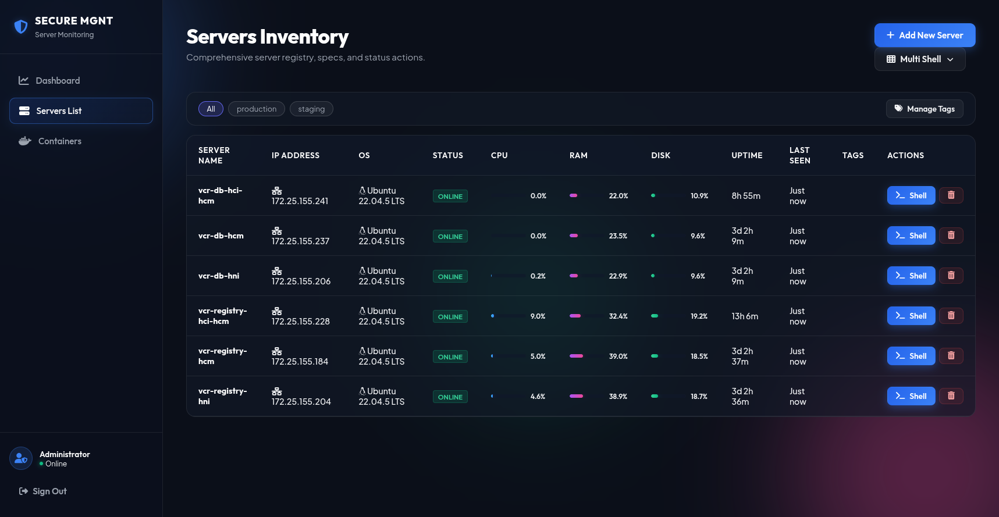
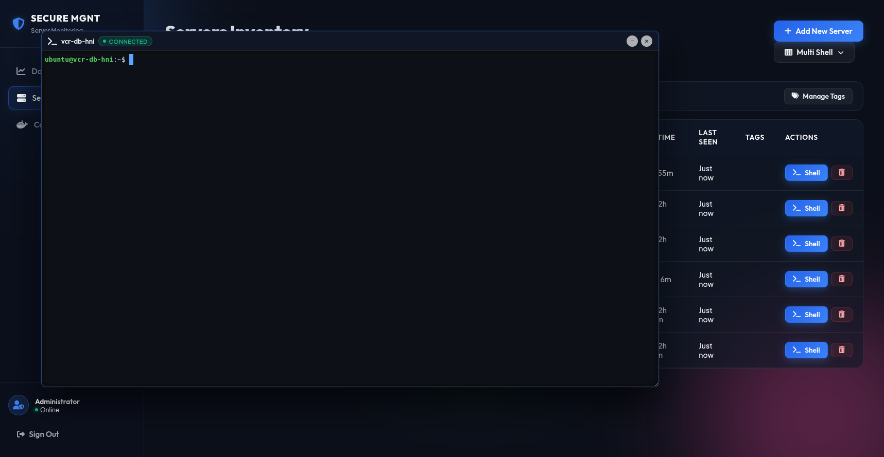
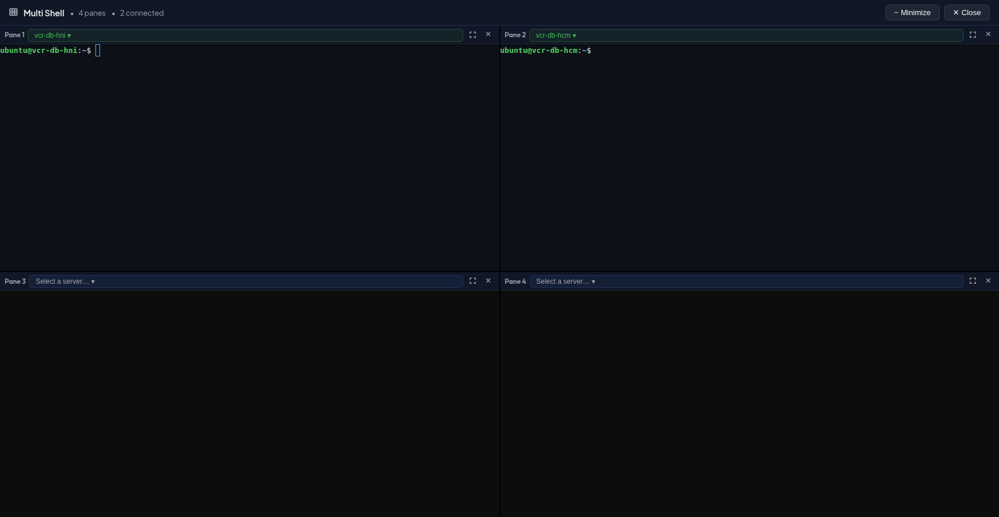
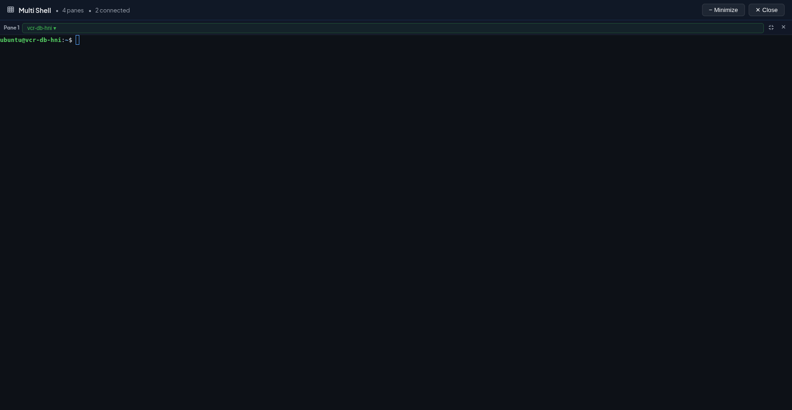
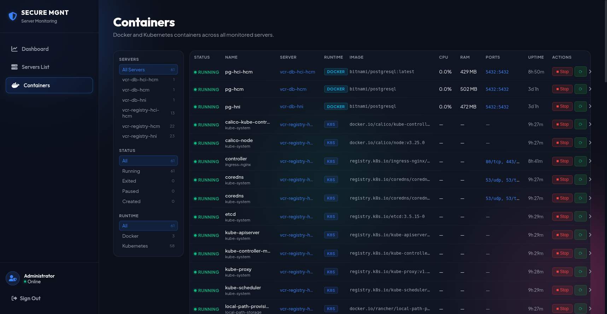

# mgnt-server

A lightweight Go dashboard for monitoring and managing remote servers — no SSH keys, no firewall holes, no agents running as root.



---

## How it works

Agents run on each target server and **call home** over outbound HTTPS. The dashboard never initiates a connection inward.

```
[Target Server]  ──outbound HTTPS──▶  [mgnt-server dashboard]
    agent binary                           port 8080 (browser)
                                           port 8443 (agent TLS)
```

No inbound firewall rules on your servers. No VPN. No SSH exposure.

---

## Features

### Infrastructure Health Dashboard
Real-time telemetry grid — CPU, RAM, Disk, Uptime per server, polling every 5 seconds.


### Servers Inventory
Full server list with live metrics, color-coded tags, and one-click shell access.



### PTY Web Terminal
Full interactive shell sessions via xterm.js + WebSocket PTY bridge. Supports resize, tab completion, and command history. `Ctrl+Shift+V` paste works correctly — arrow keys move the PTY cursor without triggering browser text selection.



### Multi Shell Overlay
Open 2, 4, or 8 tiled terminal panes simultaneously — each independently connected to a chosen server. Minimize to taskbar while keeping all sessions alive. Expand any pane to full screen and collapse back to the grid with one click.




### Container Management
Docker containers and Kubernetes pods aggregated across all servers in one view. Filter by server, runtime, or status. Stop / Start / Restart, exec a shell, or stream logs — all from the browser.



---

## Quick Start

### Docker Compose (recommended)

```bash
docker-compose up -d
docker logs secure-server-manager | grep PASSWORD
```

Open `http://localhost:8080` and log in with the printed password.

### Binary

```bash
CGO_ENABLED=0 go build -o mgnt-server .
./mgnt-server
```

Open `http://localhost:8080`. Password is printed to stdout on first run.

---

## Adding a Server

1. Open the dashboard → **Add New Server**
2. Copy the generated install command and run it on the target server:

```bash
curl -fsSL http://<dashboard>:8080/agent/install2/<token> | bash
```

The server appears online within seconds. The agent installs to `~/.mgnt-agent/` and runs as the installing user — never root.

### Auto-deploy agent on OpenStack instance creation

If you use OpenStack and want the agent installed automatically the moment a new server boots, paste the following into the **Customization Script** field when creating the instance:

```bash
#!/bin/bash
sudo -i -u ubuntu bash -c 'curl -fsSL http://<dashboard>:8080/agent/install2/<token> | bash'
```

> Replace `<dashboard>` with your mgnt-server IP/hostname and `<token>` with the token generated for this server from the dashboard. The script runs once as the `ubuntu` user on first boot — no manual SSH needed.

---

## Configuration

Stored in `data/.env` (auto-created on first run, persisted via Docker volume):

```env
MGNT_PORT=8080
MGNT_AGENT_TLS_PORT=8443
MGNT_USERNAME=admin
MGNT_PASSWORD=<generated>
MGNT_SESSION_SECRET=<generated>
```

> **Never commit `data/`** — it contains credentials and TLS private keys.

---

## Shell Sessions

| Target | Command run on agent |
|--------|----------------------|
| Host server | `bash -i` |
| Docker container | `docker exec -it <id> sh` |
| K8s pod | `kubectl exec -it <pod> -n <ns> -c <ctr> -- sh` |
| K8s logs | `kubectl logs -f --tail=200 …` |

Multiple sessions can be open simultaneously. Each is an independent PTY bridge over WebSocket.

---

## Container Page

| Column | Notes |
|--------|-------|
| Status | `running` / `exited` / `paused` |
| Name | Container or pod name; namespace shown as sub-label for K8s |
| Server | Which server manages this container |
| Runtime | `K8s` or `Docker` badge |
| Image | Truncated with hover tooltip |
| CPU / RAM | Live metrics (requires metrics-server for K8s) |
| Ports | Exposed ports |
| Uptime | Age since start |
| Actions | Stop / Start / Restart; expand row for Shell / Logs |

**K8s requirements**: `kubectl` must be installed and configured on the agent host. CPU/RAM metrics require `metrics-server` in the cluster.

---

## Agent Protocol

The Go agent binary runs four concurrent routines:

| Routine | Behavior |
|---------|----------|
| CPU sampler | Reads `/proc/stat` every second |
| Telemetry loop | `POST /agent/report` every 5 s — CPU, RAM, Disk, containers |
| Command loop | Long-poll `GET /agent/cmd/wait/<token>` — blocks 25 s, handles `exec` and `shell` commands |
| Shell handler | Per-session goroutine: opens PTY, starts target process, bridges PTY ↔ WebSocket |

A second agent instance exits immediately — startup acquires an exclusive `flock` on `agent.pid`.

---

## Security

- Agent tokens are random 32-char hex strings (128-bit entropy)
- All agent endpoints run on **TLS port 8443 only** — ECDSA P-256 cert auto-generated on first run
- Agent embeds the CA cert and uses `--resolve` for full TLS verification without public DNS
- Sessions are in-memory only — server restart clears all sessions
- Cookie is `HttpOnly`; set `Secure: true` when behind an HTTPS reverse proxy
- Agent runs as the installing user, never root
- Docker container runs as non-root (UID 1000)

---

## API Reference

### Auth

| Method | Path | Description |
|--------|------|-------------|
| `POST` | `/api/auth/login` | `{"username":"…","password":"…"}` |
| `POST` | `/api/auth/logout` | Invalidate session |
| `GET` | `/api/auth/check` | Check session validity |

### Servers

| Method | Path | Description |
|--------|------|-------------|
| `GET` | `/api/servers` | List all servers with live metrics |
| `POST` | `/api/servers/add` | Add server → returns install token |
| `DELETE` | `/api/servers/{id}` | Remove server |
| `POST` | `/api/servers/execute/{id}` | Queue shell command |
| `GET` | `/api/servers/terminal/stream/{id}` | SSE stream for command results |
| `GET` | `/api/servers/shell/{id}/ws/{session_id}` | WebSocket PTY (browser side) |

### Containers

| Method | Path | Description |
|--------|------|-------------|
| `GET` | `/api/containers` | All containers across all servers |
| `POST` | `/api/servers/{id}/containers/{cid}/action` | `start` / `stop` / `restart` |

### Tags

| Method | Path | Description |
|--------|------|-------------|
| `GET` | `/api/tags` | List tags |
| `POST` | `/api/tags` | Create `{"name":"…","color":"…"}` |
| `DELETE` | `/api/tags/{name}` | Delete (removes from all servers) |
| `PUT` | `/api/servers/{id}/tags` | Set tags `{"tags":["…"]}` |

---

## Building

```bash
# Server binary
CGO_ENABLED=0 GOOS=linux GOARCH=amd64 go build -ldflags="-w -s" -o mgnt-server .

# Agent binaries (multi-arch)
CGO_ENABLED=0 GOOS=linux GOARCH=amd64 go build -ldflags="-w -s" -o public/downloads/agent-linux-amd64 ./cmd/agent/
CGO_ENABLED=0 GOOS=linux GOARCH=arm64  go build -ldflags="-w -s" -o public/downloads/agent-linux-arm64  ./cmd/agent/
```

The Dockerfile handles all of this automatically — agent binaries are placed in `public/downloads/` and served by the dashboard.

---

## Tech Stack

| Layer | Choice |
|-------|--------|
| Backend | Go 1.22, `net/http` stdlib |
| WebSocket | `gorilla/websocket` (sole external Go dependency) |
| Agent | Go 1.22 binary, `linux/amd64` + `linux/arm64` |
| Frontend | Vanilla JS + CSS — no build step, no framework |
| Terminal | xterm.js v5 + FitAddon (CDN) |
| Persistence | JSON files (`data/servers.json`, `data/tags.json`) |
| Deploy | Docker / docker-compose, non-root Alpine container |

---

## File Structure

```
mgnt-server/
├── main.go                    # All backend logic
├── cmd/agent/main.go          # Go agent binary
├── public/
│   ├── index.html             # SPA shell
│   ├── css/style.css          # Dark glassmorphism design
│   ├── js/app.js              # Frontend SPA (vanilla JS)
│   └── downloads/             # Pre-built agent binaries (gitignored)
├── Dockerfile
├── docker-compose.yml
└── data/                      # Runtime data — NOT committed
    ├── .env
    ├── servers.json
    ├── tags.json
    └── tls/
```

---

## Development

```bash
go run main.go                        # Start on :8080

# Install a test agent
curl -fsSL http://localhost:8080/agent/install2/<token> | bash

# Watch agent log
tail -f ~/.mgnt-agent/agent.log

# Stop agent
kill $(cat ~/.mgnt-agent/agent.pid)
```

Branching: `main` is stable/production. Feature work goes on `dev` and is merged via PR.
